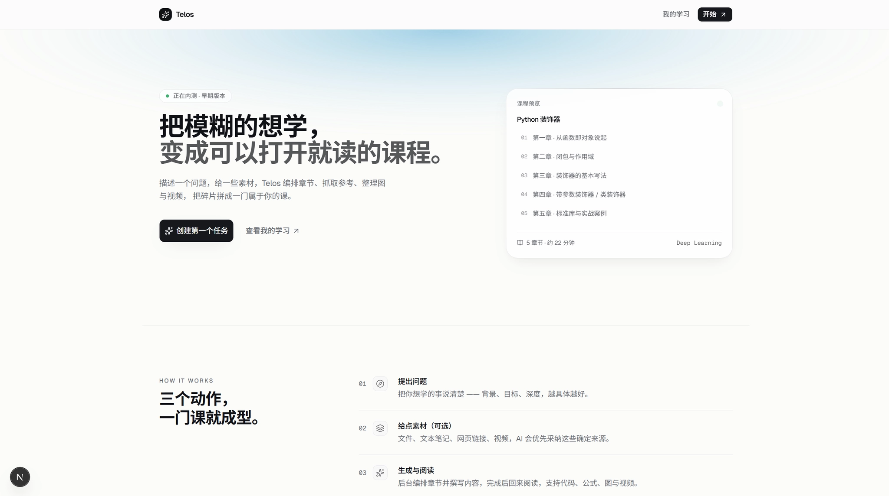
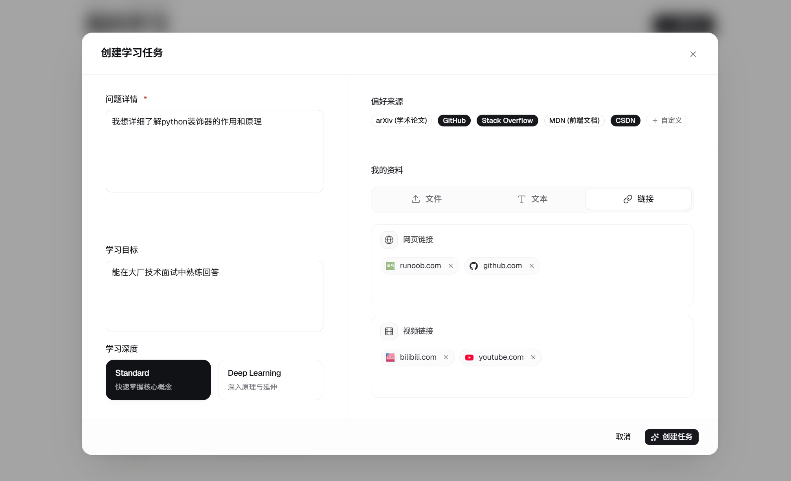
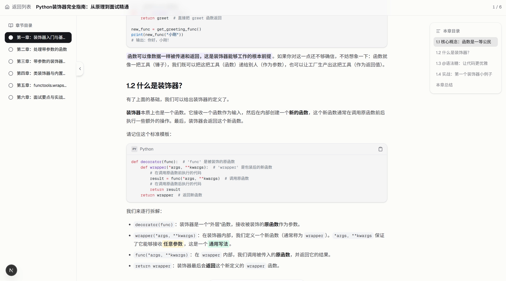

# Telos

Telos is an AI learning-workspace prototype that turns a concrete goal, trusted user materials, and retrieved online sources into a structured, multimodal course that is ready to study.



## Why Telos

Most AI learning tools return answers, summaries, or a list of links. Telos focuses on the deliverable: a complete course with ordered chapters, explanations, code, figures, and video embedded at the point where each source supports learning.

The same topic is organized differently for broad exploration, conceptual mastery, interview preparation, or academic research. A goal-configuration layer controls depth, prerequisites, examples, and emphasis before the course is generated.

## Workflow

1. Describe what you want to learn and why.
2. Add files, notes, webpages, or videos you already trust.
3. Select preferred sources and the desired learning depth.
4. Let the retrieval and generation pipeline organize a course.
5. Read the result in a focused learning workspace.

| Create a learning task | Study the generated course |
| --- | --- |
|  |  |

## Current capabilities

- asynchronous, goal-conditioned course generation;
- PDF, text, URL, image, and video source ingestion;
- retrieval, deduplication, source ranking, and citation-aware generation;
- structured chapters with code highlighting, mathematics, Mermaid diagrams, and embedded media;
- a course workspace for generation status and reading progress.

## Architecture

- Web: Next.js 16, React, TypeScript, Tailwind CSS 4, TanStack Query
- API: FastAPI, SQLAlchemy, SQLite
- Retrieval: Tavily, Jina Reader, GitHub and arXiv source adapters
- Storage: local uploads and LanceDB vectors
- Models: configurable text, vision, embedding, and speech providers

```text
web/       Next.js interface and course reader
server/    FastAPI routes, generation agents, retrieval, and media services
docs/      product and implementation notes
data/      local databases, vectors, uploads, and debug output (ignored)
```

## Run locally

Requirements: Node.js 20+, Python 3.11+, and an API key for the configured text model.

```bash
git clone https://github.com/GaryYang12345/Telos.git
cd Telos/server
cp .env.example .env
python -m venv venv
source venv/bin/activate
pip install -r requirements.txt
uvicorn app.main:app --reload --port 8000
```

In another terminal:

```bash
cd Telos/web
npm install
npm run dev
```

Open `http://localhost:3000`. Environment variables and optional retrieval, vision, and speech providers are documented in `server/.env.example`.

## Status

Telos is an active prototype. The current repository demonstrates the end-to-end product direction; editing, tutoring, exercises, flashcards, and additional source connectors remain in development.

## License

MIT
